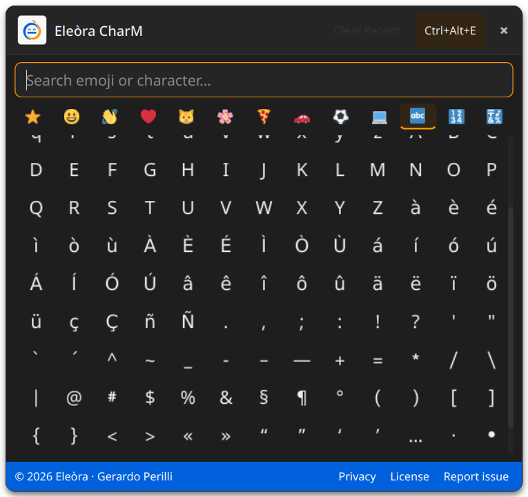

# Eleòra CharM

A lightweight emoji and special character picker for Linux/KDE.


---

## Screenshot

| Light | Dark |
|---|---|
|  |  |

---

## Features

* **Emoji picker** — browse emoji grouped by category: smileys, gestures, hearts, animals, nature, food, vehicles, sport and objects
* **Special characters** — includes Latin accents, punctuation, math symbols, arrows, Greek letters, currency symbols and typography marks
* **Search** — search by Unicode name or by the character itself
* **Recents** — recently used characters are kept locally and can be cleared from the UI
* **Clipboard copy** — selected characters are copied to the clipboard
* **Auto-paste on X11** — optionally pastes directly into the previously focused window through `xdotool`
* **Wayland-friendly mode** — works through the clipboard; `--show` can be used from a KDE custom shortcut
* **Global hotkey** — `Ctrl+Alt+E` opens or closes the picker when `pynput` is available
* **System tray** — quick access, paste method status and quit action
* **Local Twemoji rendering** — uses local PNG assets for reliable color emoji rendering on Linux/KDE
* **Unicode font fallback** — text symbols are rendered with installed symbol/math fonts such as Noto Sans Symbols or Noto Sans Math
* **Bilingual UI** — Italian and English, auto-detected from the system locale
* **Light/dark styling** — adapts to the active Qt/KDE palette at startup

---

## Important notes

* **Local Twemoji assets are required.** Place the PNG files in:

  ```text
  ./assets/twemoji/*.png
  ```

  You can check missing assets with:

  ```bash
  python charm.py --check-assets
  ```

* **Theme colors are evaluated at startup.** Restart CharM after changing the KDE color scheme.

* **Global hotkey support is optional.** If `pynput` is not installed, CharM still works from the tray or with `python charm.py --show`.

* **Auto-paste depends on the session.**
  * On X11, CharM can paste directly using `xdotool`.
  * On Wayland, CharM copies to the clipboard by default. Configure a KDE custom shortcut that runs `python /path/to/charm.py --show`.

* **Special symbols need Unicode fonts.** On Fedora, the recommended packages are Noto Sans Symbols, Noto Sans Symbols 2 and Noto Sans Math.

---

## How it works

* CharM runs as a tray application and does not quit when the picker window closes
* Selecting an item copies the character to the clipboard
* Recent characters are stored locally in `~/.config/eleora-charm/recent.json`
* Preferences are stored locally in `~/.config/eleora-charm/config.json`
* A per-user Unix socket in `/tmp/eleora-charm_<uid>.sock` is used only to show the already-running instance when `--show` is called
* No root privileges are required
* No analytics, tracking or background network requests are performed

---

## Requirements

- Linux
- KDE Plasma recommended
- Python 3.10+
- PySide6
- Local Twemoji PNG assets
- Noto symbol fonts recommended
- `pynput` *(optional — global hotkey)*
- `xdotool` *(optional — direct auto-paste on X11)*
- `ydotool` *(optional — simulated paste on Wayland setups where it is configured and available)*

---

## Installation

```bash
git clone https://github.com/eleora-dev/charm.git
cd charm
pip install PySide6 pynput --break-system-packages
sudo dnf install google-noto-sans-symbols-fonts google-noto-sans-symbols-2-fonts google-noto-sans-math-fonts
sudo dnf install xdotool
python charm.py
```

If you do not want the global hotkey, `pynput` can be omitted.

---

## Autostart

Copy the desktop file to KDE autostart:

```bash
cp emoji_picker.desktop ~/.config/autostart/
```

Or start manually:

```bash
python charm.py
```

---

## Keyboard shortcuts

* `Ctrl+Alt+E` → open/close picker when the global hotkey listener is available
* `Esc` → close the picker
* `Enter` → select the first search result

On Wayland/KDE, add a custom shortcut in:

```text
System Settings → Shortcuts → Custom Shortcuts
```

Use this command:

```bash
python /path/to/charm.py --show
```

---

## Command-line options

```bash
python charm.py --show
```

Shows the already-running picker instance, or starts normally if no instance is running.

```bash
python charm.py --check-assets
```

Checks whether all required local Twemoji PNG assets are present.

---

## Privacy

CharM does not collect, transmit or share personal data.
It stores only local preferences and recent characters on your device.

Full privacy policy: [eleora-dev.github.io/charm/privacy.html](https://eleora-dev.github.io/charm/privacy.html)

---

## Third-party assets

CharM uses local emoji graphics from [Twemoji](https://github.com/twitter/twemoji).

Twemoji graphics are licensed under CC-BY 4.0.
Twemoji code is licensed under the MIT License.

Copyright Twitter, Inc. and other contributors.

---

## License

MIT License — see [LICENSE](LICENSE) for details.

---

## Author

Gerardo Perilli · [Eleòra](https://github.com/eleora-dev)
